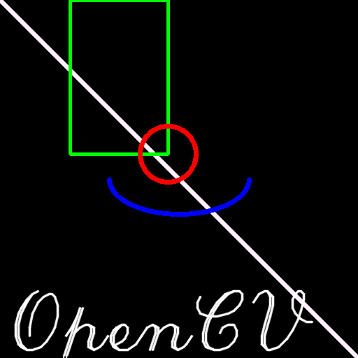

# Goal : Learn to draw geometric shapes in OpenCV
## Code :

 __In all the functions, you will see some common arguments as given below:__
<ol>
<li>img : The image where you want to draw the shapes</li>
<li>color : Color of the shape. for BGR, pass it as a tuple, eg: (255,0,0) for blue. 
For grayscale, just pass the scalar value.</li>
<li>thickness : Thickness of the line or circle etc. 
If -1 is passed for closed figures like circles, it will fill the shape. 
default thickness = 1</li>
<li>lineType : Type of line, whether 8-connected, anti-aliased line etc. 
By default, it is 8-connected. cv2.LINE_AA gives anti-aliased line which looks great for curves.</li>
</ol>

## Basic Functions:
<ol>
	<li>cv2.line()</li>
	<li>cv2.rectangle ()</li>
	<li>cv2.circle()</li>
	<li>cv2.ellipse()</li>
	<li>cv2.putText() </li>
</ol>

## Result :

